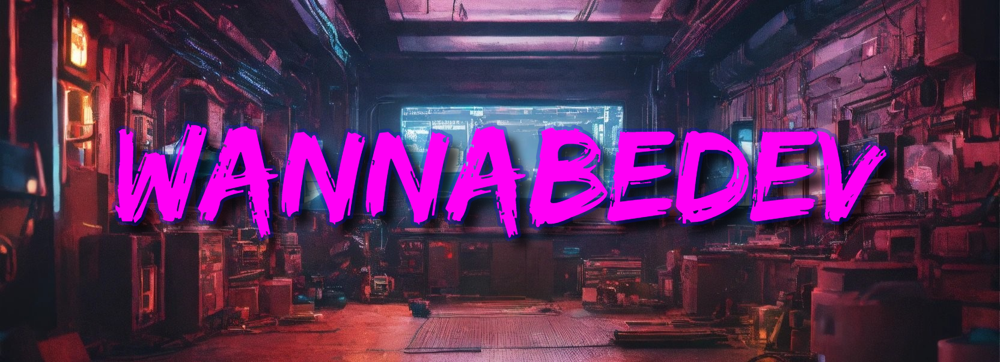

<h2>

## Hi there :wave I'm Greg a indie game developer/designer

<!-- HERE SHOULD BE A LINK TO ITCHIO,YT TIWTTER AND SOMETHING ELSE

  
##################
-->

<!--
* :telescope: I am currently working on a [Name of prject] (https://LINKTOproject)
* :memo: I write articles on [my web](https://fronkongames.github.io/).
* :speech_balloon: Ask me about **game development** and **Unity** (**email**). -->

### ⚙️ Software Stack

#### ⚒ Languages

#### 🔧 Tools

<!-- 

#### 📁 Databases

 -->

| Left-aligned | Center-aligned | Right-aligned |
| :---         |     :---:      |          ---: |
|     | git status     | git status    |
| git diff     | git diff       | git diff      |

<!-- ### 🏢 Working on -->
<!-- <a href="https://github.com/Smbrer1/melon-back-end"> -->
<!--    -->
<!-- </a> -->
